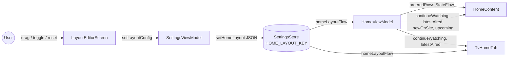
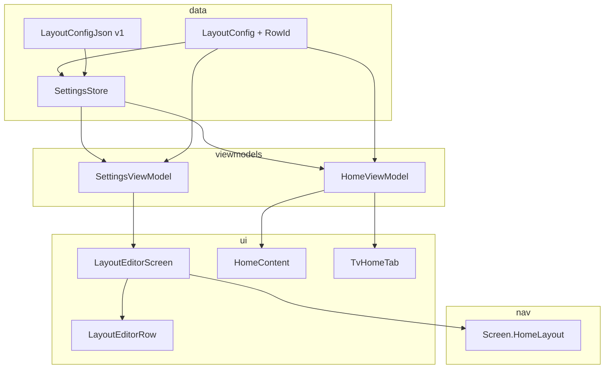

# Design Document

## Overview

The Home Layout Customization feature lets users reorder and toggle the four configurable rows on the Home Screen (`continue_watching`, `latest_episodes`, `new_on_app`, `upcoming`). The Hero Carousel is governed by an existing toggle (`expanded_hero_carousel`) and is out of scope. Changes apply immediately, persist across launches, and can be reset to defaults.

The design adds a single source of truth — `LayoutConfig` — that flows from `SettingsStore` through `HomeViewModel` into `HomeScreen` and `TvAppShell`. The mobile/desktop home tab gains a `Layout_Editor` screen reachable from the Appearance settings tab and the home top‑bar overflow menu. The TV variant consumes the same flow but does not expose an editor and only renders rows it supports today.

The feature is local‑only for now, but the persisted JSON shape carries an explicit schema `version` so a future Anisurge BFF settings sync endpoint can adopt it without changes.

### Goals

- Drive Home Screen row order and visibility from a single `Flow<LayoutConfig>` exposed by `SettingsStore`.
- Apply layout changes within 200 ms of the user gesture and persist within 500 ms (Req 3.2, 3.4, 4.2, 4.4, 5.3, 6.1).
- Keep Home Screen functional under storage failure, schema drift, and partial/invalid stored data (Req 2.2, 2.4, 6.4–6.6, 11.3–11.6, 12.1–12.6).
- Provide an accessible editor with drag, Move up/Move down buttons, visibility toggle, and Reset (Req 3.1, 4.1, 7.1, 10.1–10.6).

### Non-goals

- BFF push/pull of `LayoutConfig`. The schema is sync‑ready (Req 11.7), but no BFF endpoint is wired in this feature.
- Customizing the Hero Carousel position/visibility (Req 1.2). The existing `expanded_hero_carousel` toggle is unchanged.
- Adding new home rows or changing TV‑supported rows. The TV variant continues to render only the rows it already supports (`continue_watching`, `latest_episodes`).

### Research notes

- **DataStore Flow pattern (existing).** `SettingsStore.serverPriorityFlow` already round‑trips a JSON list under a `stringPreferencesKey` and falls back to `emptyList()` on parse failure. We mirror that pattern with a versioned envelope. Reference: [`SettingsStore.kt`](composeApp/src/commonMain/kotlin/to/kuudere/anisuge/data/services/SettingsStore.kt).
- **Drag‑reorder library choice.** Compose Multiplatform 1.6+ does not ship a first‑party reorderable `LazyColumn`. Kotlin Multiplatform options like `org.burnoutcrew.composereorderable` exist but require an extra dependency and have lagged Compose updates. The codebase already uses `Modifier.draggable` and `detectDragGestures` (e.g. seek bar, server priority list). We implement the editor on top of a `Column` of `LayoutEditorRow` items using `pointerInput { detectDragGestures }` for the drag handle and explicit `IconButton`s for Move up/Move down. This keeps the feature dep‑free and consistent with the codebase, and the four‑row max keeps a non‑lazy column trivially performant.
- **Continue Watching dedupe.** `latestPerAnime()` in `ContinueWatchingUtils.kt` already projects the BFF `continueWatchingAll` list into one row per anime for the home view. The layout config does not change that projection — it only decides whether the row is rendered and where.
- **TV variant scope.** `TvHomeTab` in `TvAppShell.kt` currently renders only the hero, `continueWatching`, and `latestAired` (`Latest`). It does not render `newOnSite` or `upcoming`. The TV‑supported Row_Id set is therefore `{continue_watching, latest_episodes}` (Req 9.1, 9.2).
- **Settings UX convention.** Per AGENTS.md, settings apply immediately via `SettingsStore` Flows, not via a Save button. The editor follows that convention: every drag drop, toggle, or Move button click writes to `SettingsStore` immediately.

## Architecture

### High-level flow



### Components



### Single source of truth

`SettingsStore.homeLayoutFlow: Flow<LayoutConfig>` is the only producer of layout data the UI consumes. Both `HomeViewModel` and `TvAppShell` collect it. The Layout Editor never holds its own private copy — it derives its on‑screen state by `collectAsState()` on the same flow and writes back through `SettingsViewModel.setHomeLayout(...)`.

This guarantees Req 5.1–5.3: any persisted change emits to all consumers within 500 ms, and the same composition that triggered the change re‑renders on the next frame.

### Optimistic apply with rollback

To meet the 200 ms apply budget (Req 3.2, 4.2) without waiting on disk I/O:

1. The editor maintains a `pendingLayout: MutableState<LayoutConfig>` reflecting what the user is currently dragging/toggling.
2. On gesture release / toggle / Move click / reset confirm, the editor calls `SettingsViewModel.setHomeLayout(pendingLayout)`.
3. `SettingsViewModel` writes to `SettingsStore` in a coroutine. If the write throws, it sets `lastSaveError` on its own state and the editor surfaces a non‑blocking error with a retry control (Req 3.6, 4.7, 5.4, 7.6, 12.3–12.6).
4. The Home Screen always reflects the current `homeLayoutFlow` value, which only changes after a successful write. On write failure, Home stays on the last good layout. The editor preserves the user's intended state in‑memory (Req 12.3) and shows the retry banner.

## Components and Interfaces

### `RowId` enum (commonMain)

`data/models/RowId.kt`

```kotlin
@Serializable
enum class RowId(val storageId: String) {
    CONTINUE_WATCHING("continue_watching"),
    LATEST_EPISODES("latest_episodes"),
    NEW_ON_APP("new_on_app"),
    UPCOMING("upcoming");

    companion object {
        /** Case-sensitive lookup. Returns null for unknown ids. (Req 1.1, 1.3) */
        fun fromStorageId(id: String): RowId? = entries.firstOrNull { it.storageId == id }

        /** TV-supported subset. (Req 9.1, 9.2) */
        val TV_SUPPORTED: Set<RowId> = setOf(CONTINUE_WATCHING, LATEST_EPISODES)
    }
}
```

### `LayoutConfig` data class (commonMain)

`data/models/LayoutConfig.kt`

```kotlin
data class LayoutRow(val id: RowId, val visible: Boolean)

data class LayoutConfig(val rows: List<LayoutRow>) {
    companion object {
        const val SCHEMA_VERSION: Int = 1

        /** Default_Layout: all four rows visible, in canonical order. (Req 2.1, 2.2) */
        val DEFAULT: LayoutConfig = LayoutConfig(
            rows = listOf(
                LayoutRow(RowId.CONTINUE_WATCHING, visible = true),
                LayoutRow(RowId.LATEST_EPISODES, visible = true),
                LayoutRow(RowId.NEW_ON_APP, visible = true),
                LayoutRow(RowId.UPCOMING, visible = true),
            )
        )
    }

    /** Append any RowIds not present, with visible = true, in DEFAULT order. (Req 2.2, 6.6, 4.8) */
    fun mergeWithDefaults(): LayoutConfig {
        val present = rows.map { it.id }.toSet()
        val missing = DEFAULT.rows.filter { it.id !in present }
        return if (missing.isEmpty()) this else LayoutConfig(rows + missing)
    }

    /** Drop unknown RowIds and duplicates (keep first). (Req 1.3, 1.5) */
    fun sanitize(): LayoutConfig {
        val seen = mutableSetOf<RowId>()
        val kept = mutableListOf<LayoutRow>()
        for (row in rows) {
            if (seen.add(row.id)) kept += row
        }
        return LayoutConfig(kept)
    }

    fun moveUp(id: RowId): LayoutConfig = movedBy(id, -1)
    fun moveDown(id: RowId): LayoutConfig = movedBy(id, +1)
    fun reorder(fromIndex: Int, toIndex: Int): LayoutConfig
    fun setVisible(id: RowId, visible: Boolean): LayoutConfig
}
```

### `LayoutConfigJson` v1 schema (commonMain)

`data/models/LayoutConfigJson.kt`

```kotlin
@Serializable
data class LayoutConfigJson(
    val version: Int,
    val rows: List<LayoutRowJson>,
)

@Serializable
data class LayoutRowJson(
    val id: String,         // RowId.storageId
    val visible: Boolean,
)
```

A pure `LayoutConfigCodec` object provides:

- `fun encode(config: LayoutConfig): String` — always emits `version = SCHEMA_VERSION`.
- `fun decode(jsonString: String): DecodeResult` — `Success(LayoutConfig)`, `VersionTooNew`, or `Invalid(reason)`. The Home/Editor branch on the variant to satisfy Req 11.3, 11.4, 11.5, 11.6, 6.4.

### `SettingsStore` additions

```kotlin
val HOME_LAYOUT_KEY = stringPreferencesKey("home_layout_v1")

val homeLayoutFlow: Flow<LayoutConfig> = dataStore.data
    .catch { e ->
        // Req 12.1 — log and emit Default_Layout
        Logger.w("SettingsStore", "homeLayoutFlow read failed: ${e.message}")
        emit(emptyPreferences())
    }
    .map { prefs ->
        val raw = prefs[HOME_LAYOUT_KEY]
        if (raw.isNullOrBlank()) {
            LayoutConfig.DEFAULT
        } else {
            when (val r = LayoutConfigCodec.decode(raw)) {
                is DecodeResult.Success -> r.config.sanitize().mergeWithDefaults()
                is DecodeResult.VersionTooNew -> LayoutConfig.DEFAULT  // Req 11.3, 11.4 (don't overwrite)
                is DecodeResult.Invalid -> LayoutConfig.DEFAULT          // Req 11.5, 11.6, 6.4
            }
        }
    }
    .distinctUntilChanged()

suspend fun setHomeLayout(config: LayoutConfig) {
    dataStore.edit { it[HOME_LAYOUT_KEY] = LayoutConfigCodec.encode(config) }
}

/** Heal helper used after first read to persist sanitize+merge. (Req 2.2, 2.4, 6.6) */
suspend fun healHomeLayoutIfNeeded(seen: LayoutConfig)
```

`healHomeLayoutIfNeeded` reads the raw string once. If decode succeeds and the stored config differs from the sanitized/merged result, it overwrites once. If decode is `Invalid`, it overwrites with `DEFAULT` (Req 6.4). It is **not** called for `VersionTooNew` (Req 11.4, 11.6). The ViewModel calls it once at startup after the first successful flow emission.

### `HomeViewModel` wiring

`HomeUiState` gets a derived field:

```kotlin
data class HomeUiState(
    /* existing fields */
    val layout: LayoutConfig = LayoutConfig.DEFAULT,
)
```

`HomeViewModel.init` adds:

```kotlin
scope.launch {
    settingsStore.homeLayoutFlow.collect { layout ->
        _uiState.update { it.copy(layout = layout) }
    }
}
scope.launch { settingsStore.healHomeLayoutIfNeeded(_uiState.value.layout) }
```

`HomeViewModel` exposes a `visibleRows(state)` projection used by the UI:

```kotlin
fun visibleRowsForMobile(state: HomeUiState): List<RowId> =
    state.layout.rows.filter { it.visible }.map { it.id }

fun visibleRowsForTv(state: HomeUiState): List<RowId> =
    state.layout.rows.filter { it.visible && it.id in RowId.TV_SUPPORTED }.map { it.id }
```

### `HomeContent` rendering

`HomeContent` switches from a hardcoded sequence of `if` blocks to a single iteration over the projected order:

```kotlin
val orderedRowIds = state.layout.rows.filter { it.visible }.map { it.id }
val nonEmptyRowIds = orderedRowIds.filter { state.hasDataForRow(it) }

if (orderedRowIds.isEmpty()) {
    EmptyLayoutPlaceholder(onOpenEditor = onOpenLayoutEditor)  // Req 4.6
} else {
    Column { /* hero stays as-is */
        nonEmptyRowIds.forEach { rowId ->
            when (rowId) {
                RowId.CONTINUE_WATCHING -> ContinueWatchingSection(...)
                RowId.LATEST_EPISODES   -> LatestEpisodesSection(...)
                RowId.NEW_ON_APP        -> NewOnAppSection(...)
                RowId.UPCOMING          -> UpcomingSection(...)
            }
        }
    }
}

fun HomeUiState.hasDataForRow(id: RowId): Boolean = when (id) {
    RowId.CONTINUE_WATCHING -> continueWatching.isNotEmpty()
    RowId.LATEST_EPISODES   -> latestAired.isNotEmpty()
    RowId.NEW_ON_APP        -> newOnSite.isNotEmpty()
    RowId.UPCOMING          -> upcoming.isNotEmpty()
}
```

This satisfies Req 4.5 (`visible = true` rows with empty data are hidden but kept in config) and Req 4.6 (all‑hidden empty placeholder includes a button to open the editor). Req 4.3 follows because the row, its header, and its spacing live inside the `when` branch and are skipped together when the row is filtered out.

The Home top‑bar overflow menu gains a "Home Layout" entry (Req 8.3, 8.4) that calls `onOpenLayoutEditor`.

### `LayoutEditorScreen`

`screens/settings/layout/LayoutEditorScreen.kt`

State held inside the screen:

```kotlin
val layout by settingsViewModel.uiState.map { it.homeLayout }.collectAsState(LayoutConfig.DEFAULT)
var pendingLayout by remember { mutableStateOf(layout) }
LaunchedEffect(layout) { pendingLayout = layout }    // sync after persist round-trip

val saveError = settingsViewModel.uiState.collectAsState().value.layoutSaveError
```

Layout:

- Top app bar with back arrow and "Reset to defaults" overflow / button (Req 7.1).
- Vertical list of `LayoutEditorRow(row, index, total, isFirst, isLast)`.
- Optional non‑blocking error banner pinned above the list when `saveError != null`, with a "Retry" button (Req 12.4–12.6).

`LayoutEditorRow`:

- Drag handle on the leading edge using `pointerInput { detectDragGestures }`. On drag end, swap rows in `pendingLayout` based on accumulated translation, then call `settingsViewModel.setHomeLayout(pendingLayout)` (Req 3.2, 3.4).
- Localized title text from `LocalAppStrings` falling back to `RowId.storageId` (Req 10.6).
- "Visible" / "Hidden" indicator label (Req 3.1).
- Visibility `Switch` (Req 4.1).
- `IconButton(Move up)` and `IconButton(Move down)` with `enabled = !isFirst` / `enabled = !isLast` (Req 10.1–10.3).
- Each control sets a `Modifier.semantics { stateDescription = ... }` so the platform a11y service announces the new index/visibility (Req 10.4, 10.5).
- D‑pad / keyboard focus uses the existing `tvFocusableClick` pattern from `to.kuudere.anisuge.ui` so focus indicators are consistent.

Reset flow:

- The Reset button uses the existing `ConfirmDialog` helper (Req 7.2). Confirm calls `settingsViewModel.resetHomeLayout()` which writes `LayoutConfig.DEFAULT` to `SettingsStore`. Cancel dismisses (Req 7.5). On write failure, the existing error banner pattern handles surfacing (Req 7.6).

### `SettingsViewModel` additions

```kotlin
data class SettingsUiState(
    /* existing fields */
    val homeLayout: LayoutConfig = LayoutConfig.DEFAULT,
    val layoutSaveError: String? = null,
)

init {
    scope.launch {
        settingsStore.homeLayoutFlow.collect { layout ->
            _uiState.update { it.copy(homeLayout = layout) }
        }
    }
}

fun setHomeLayout(next: LayoutConfig) {
    val sanitized = next.sanitize().mergeWithDefaults()
    scope.launch {
        try {
            settingsStore.setHomeLayout(sanitized)
            _uiState.update { it.copy(layoutSaveError = null) }   // Req 12.6
        } catch (e: Throwable) {
            Logger.e("SettingsVM", "Failed to persist home layout", e)
            _uiState.update { it.copy(layoutSaveError = e.message ?: "Save failed") }  // Req 3.6, 4.7, 12.4
        }
    }
}

fun resetHomeLayout() = setHomeLayout(LayoutConfig.DEFAULT)
fun retrySaveHomeLayout() = setHomeLayout(_uiState.value.homeLayout /* or pending */)
fun dismissLayoutSaveError() { _uiState.update { it.copy(layoutSaveError = null) } }
```

### `Screen.kt` route addition

```kotlin
data object HomeLayout : Screen("settings/home-layout")
```

The Appearance settings tab adds a navigable "Home Layout" list item that pushes `Screen.HomeLayout` (Req 8.1, 8.2). The Home Screen overflow menu adds a parallel entry (Req 8.3, 8.4). Navigation failure is handled by `NavController` exception → snack bar (Req 8.5).

### `TvHomeTab` consumption

`TvHomeTab` already receives `HomeUiState`. After this feature, it iterates `state.layout.rows` filtered by `visible && id in TV_SUPPORTED`:

```kotlin
state.layout.rows
    .filter { it.visible && it.id in RowId.TV_SUPPORTED }
    .forEach { row ->
        when (row.id) {
            RowId.CONTINUE_WATCHING -> if (state.continueWatching.isNotEmpty()) item { ... }
            RowId.LATEST_EPISODES   -> if (state.latestAired.isNotEmpty())     item { ... }
            else -> Unit  // Req 9.2 — silently skip
        }
    }
```

If the filtered subset is empty, only the hero remains; no error UI (Req 9.5). The TV variant exposes no entry to the Layout Editor (Req 9.3). Because `TvHomeTab` collects the same `homeLayoutFlow` indirectly via `HomeViewModel`, mobile/desktop edits emit to TV on the next composition (Req 9.4).

## Data Models

### Domain types (commonMain)

```kotlin
enum class RowId { CONTINUE_WATCHING, LATEST_EPISODES, NEW_ON_APP, UPCOMING }

data class LayoutRow(val id: RowId, val visible: Boolean)

data class LayoutConfig(val rows: List<LayoutRow>) {
    companion object {
        const val SCHEMA_VERSION: Int = 1
        val DEFAULT: LayoutConfig
    }
    fun sanitize(): LayoutConfig
    fun mergeWithDefaults(): LayoutConfig
    fun moveUp(id: RowId): LayoutConfig
    fun moveDown(id: RowId): LayoutConfig
    fun reorder(fromIndex: Int, toIndex: Int): LayoutConfig
    fun setVisible(id: RowId, visible: Boolean): LayoutConfig
}
```

### Persistence schema (DataStore string preference `home_layout_v1`)

JSON, encoded with `kotlinx.serialization`:

```json
{
  "version": 1,
  "rows": [
    { "id": "continue_watching", "visible": true },
    { "id": "latest_episodes",   "visible": true },
    { "id": "new_on_app",        "visible": true },
    { "id": "upcoming",          "visible": true }
  ]
}
```

Field contracts (Req 11.1, 11.2):

- `version`: required, non‑negative integer. The running build emits `SCHEMA_VERSION` (currently 1).
- `rows`: required array. Each entry has `id: String` (matching `RowId.storageId`) and `visible: Boolean`.
- Unknown JSON keys are tolerated by `kotlinx.serialization` (configured `ignoreUnknownKeys = true`) so future BFF‑added fields don't break v1 readers.

### Decode behavior

| Stored value | `decode()` result | Effect |
| --- | --- | --- |
| Absent / blank | n/a | Emit `DEFAULT`. Heal step writes `DEFAULT` once (Req 6.3). |
| `version == 1`, parses, valid `id`s | `Success` | Emit `sanitize().mergeWithDefaults()`. If different from raw, heal step rewrites once (Req 1.3, 1.5, 2.2, 6.6). |
| `version == 1`, parses, contains unknown `id` strings | `Success` after sanitize | Unknown ids dropped; remaining order preserved (Req 1.3). |
| `version > 1` | `VersionTooNew` | Emit `DEFAULT`. Stored bytes left **unchanged** (Req 11.3, 11.4). |
| Malformed JSON / wrong types / missing required fields | `Invalid` | Emit `DEFAULT`. Heal step overwrites with `DEFAULT` (Req 6.4, 11.5). |

Note the asymmetry between `Invalid` (we overwrite, Req 6.4) and `VersionTooNew` (we preserve, Req 11.4) — they look similar but the spec is intentionally different so a downgrade does not destroy a newer device's settings.

### TV-supported subset

`RowId.TV_SUPPORTED = { CONTINUE_WATCHING, LATEST_EPISODES }` (Req 9.1). Adding TV support for `NEW_ON_APP` or `UPCOMING` later is a single‑line change to that set plus a corresponding `when` branch in `TvHomeTab`.


## Correctness Properties

*A property is a characteristic or behavior that should hold true across all valid executions of a system — essentially, a formal statement about what the system should do. Properties serve as the bridge between human-readable specifications and machine-verifiable correctness guarantees.*

The properties below are derived from the prework analysis and consolidated to remove redundancy. Each property is universally quantified and traceable to one or more requirements.

### Property 1: Sanitization correctness

*For any* input list of `(idString, visible)` pairs, `LayoutConfig.sanitize()` after JSON decode produces a list where (a) every `id` maps to a known `RowId`, (b) each `RowId` appears at most once, (c) for each retained `RowId`, its `visible` flag equals the `visible` flag of its **first** occurrence in the input, and (d) the relative order of distinct valid `RowId`s in the input equals their order in the output.

**Validates: Requirements 1.3, 1.5**

### Property 2: `mergeWithDefaults` completeness

*For any* sanitized `LayoutConfig`, `mergeWithDefaults()` returns a config where (a) all four `RowId`s appear exactly once, (b) `RowId`s present in the input retain their position and `visible` flag, (c) `RowId`s missing from the input are appended in `Default_Layout` order with `visible = true`.

**Validates: Requirements 1.4, 2.2, 4.8, 6.6**

### Property 3: JSON encode/decode round-trip

*For any* sanitized, default-merged `LayoutConfig`, `LayoutConfigCodec.decode(LayoutConfigCodec.encode(config))` equals `DecodeResult.Success(config)`, and the encoded JSON is a JSON object with an integer field `version` equal to `SCHEMA_VERSION` and an array field `rows` of objects each containing a string `id` (matching some `RowId.storageId`) and a Boolean `visible`.

**Validates: Requirements 6.5, 11.1, 11.2**

### Property 4: Decode robustness — invalid input falls back to `Default_Layout` and overwrites

*For any* string `s` that is either not valid JSON, parses to JSON that does not match the schema, or parses with `version <= SCHEMA_VERSION` but contains structurally invalid fields, `SettingsStore.homeLayoutFlow` emits `LayoutConfig.DEFAULT`, and after `healHomeLayoutIfNeeded` runs the stored bytes for `HOME_LAYOUT_KEY` equal `LayoutConfigCodec.encode(LayoutConfig.DEFAULT)`.

**Validates: Requirements 2.3, 2.4, 6.4, 11.5**

### Property 5: Decode robustness — version too new preserves stored bytes

*For any* JSON string that parses with an integer `version > SCHEMA_VERSION`, `SettingsStore.homeLayoutFlow` emits `LayoutConfig.DEFAULT` while the stored bytes for `HOME_LAYOUT_KEY` remain byte-for-byte unchanged after read and `healHomeLayoutIfNeeded`.

**Validates: Requirements 11.3, 11.4**

### Property 6: Reorder correctness, propagation, and persistence

*For any* `LayoutConfig` of size `n >= 2` and any `(fromIndex, toIndex)` in `[0, n)`, `LayoutConfig.reorder(from, to)` produces the in-place move of the input rows. After invoking `SettingsViewModel.setHomeLayout(reordered)`: (a) `SettingsStore.homeLayoutFlow` emits the reordered config within 500 ms, (b) `HomeViewModel.uiState.layout` equals it within 1 s, (c) the DataStore preference at `HOME_LAYOUT_KEY` equals `LayoutConfigCodec.encode(reordered)` and no other preference key is modified.

**Validates: Requirements 3.2, 3.3, 3.4, 5.1, 5.2, 5.3, 6.1**

### Property 7: Visibility toggle correctness, propagation, and persistence

*For any* `LayoutConfig` and any `RowId` present in it, `LayoutConfig.setVisible(id, b)` produces a config in which the `LayoutRow` for `id` has `visible == b` and every other row is unchanged. After invoking `SettingsViewModel.setHomeLayout(toggled)`, the same propagation and persistence guarantees as Property 6 hold (within 500 ms emission, within 1 s `uiState`, single-key write).

**Validates: Requirements 4.1, 4.2, 4.4**

### Property 8: Render projection — mobile and TV

*For any* `LayoutConfig` and any "data populated" subset of `RowId` (continueWatching, latestAired, newOnSite, upcoming) the system SHALL satisfy:

- (a) The mobile/desktop `HomeContent` rendered row set equals `layout.rows.filter { it.visible && state.hasDataForRow(it.id) }`, in `LayoutConfig` order.
- (b) When `layout.rows.none { it.visible }`, `HomeContent` renders the empty-layout placeholder containing a button that opens the Layout Editor.
- (c) The TV `TvHomeTab` rendered row set equals `layout.rows.filter { it.visible && it.id in RowId.TV_SUPPORTED && state.hasDataForRow(it.id) }`, in `LayoutConfig` order.
- (d) When the TV-filtered set is empty, `TvHomeTab` renders no error UI in its rows area.

**Validates: Requirements 4.3, 4.5, 4.6, 9.1, 9.2, 9.4, 9.5**

### Property 9: Persist failure preserves user intent and surfaces a non-blocking error

*For any* starting `LayoutConfig`, any intended new `LayoutConfig`, and any failure thrown by `SettingsStore.setHomeLayout`: (a) `SettingsStore.homeLayoutFlow.value` remains the starting config, so `HomeContent` renders the last-good layout; (b) the editor's `pendingLayout` state still equals the intended config (the user's edit is **not** rolled back in memory); (c) `SettingsViewModel.uiState.layoutSaveError` is non-null; (d) invoking `retrySaveHomeLayout()` calls `SettingsStore.setHomeLayout` with the intended config; (e) on a subsequent successful write, `layoutSaveError` becomes `null` within 1 s.

**Validates: Requirements 3.6, 4.7, 5.4, 7.6, 12.3, 12.4, 12.5, 12.6**

### Property 10: Read failure produces `Default_Layout` without a blocking dialog

*For any* exception thrown while reading or decoding `HOME_LAYOUT_KEY`, `SettingsStore.homeLayoutFlow` emits `LayoutConfig.DEFAULT` within 2 s of the failure, and no blocking dialog appears in the `HomeContent` semantics tree. The error is recorded in the application log.

**Validates: Requirements 12.1, 12.2**

### Property 11: Reset replaces stored layout with `Default_Layout`

*For any* starting `LayoutConfig`, after `SettingsViewModel.resetHomeLayout()`: (a) `SettingsStore.homeLayoutFlow` emits `LayoutConfig.DEFAULT` within 1 s, (b) the DataStore preference at `HOME_LAYOUT_KEY` equals `LayoutConfigCodec.encode(LayoutConfig.DEFAULT)`, (c) `HomeContent` re-renders all four rows in `Default_Layout` order with all `visible = true`.

**Validates: Requirements 7.3, 7.4**

### Property 12: Boundary Move controls are disabled

*For any* `LayoutConfig` of size `n >= 1`: the "Move up" control on the row at index `0` is non-interactive (rejects tap, keyboard Enter/Space, and D-pad center) and exposes a disabled state to the platform accessibility service; the "Move down" control on the row at index `n - 1` is non-interactive in the same way.

**Validates: Requirements 10.2, 10.3**

### Property 13: Accessibility announcements after order or visibility change

*For any* reorder of a row through "Move up"/"Move down" via keyboard or D-pad, the affected row's `SemanticsNode.stateDescription` updates within 500 ms to include the row's localized title, its new 1-based index, and the total row count. *For any* visibility toggle via keyboard or D-pad, the affected row's `stateDescription` updates within 500 ms to include the localized title and either "Shown" or "Hidden".

**Validates: Requirements 10.4, 10.5**

### Property 14: Editor row presence and indicators

*For any* `LayoutConfig`, `LayoutEditorScreen` renders exactly `layout.rows.size` `LayoutEditorRow` instances; each row shows (a) the localized title (or `RowId.storageId` fallback), (b) a textual "Visible"/"Hidden" indicator matching its `visible` flag, and (c) a binary visibility toggle whose state matches its `visible` flag.

**Validates: Requirements 3.1, 4.1**

### Property 15: Localized title fallback

*For any* active locale and any `RowId`, the title displayed in `LayoutEditorScreen` and in `HomeContent` section headers equals either the localized `AppStrings` entry for that `RowId` or, when no localization exists for the active locale, the literal `RowId.storageId`.

**Validates: Requirements 10.6**

## Error Handling

### Settings Store read failures

`SettingsStore.homeLayoutFlow` wraps the underlying `dataStore.data` in `.catch { e -> emit(emptyPreferences()); Logger.w(...) }` so that any I/O exception during reads degrades gracefully to `LayoutConfig.DEFAULT` rather than crashing the home screen. The catch block:

- Logs the failure with tag `SettingsStore` (Req 12.1).
- Emits an empty preferences set, which downstream maps to `LayoutConfig.DEFAULT`.
- Does **not** display any blocking dialog (Req 12.2).

### Decode failures and schema drift

`LayoutConfigCodec.decode` returns a discriminated `DecodeResult`:

| Variant | Trigger | Flow emits | Storage action |
| --- | --- | --- | --- |
| `Success(config)` | Valid v1 JSON conforming to schema | `config.sanitize().mergeWithDefaults()` | Heal once if sanitized config differs from raw |
| `VersionTooNew` | JSON parses with `version > 1` | `LayoutConfig.DEFAULT` | None — preserve stored bytes (Req 11.4) |
| `Invalid(reason)` | Malformed JSON, wrong types, missing required fields | `LayoutConfig.DEFAULT` | Overwrite with `encode(DEFAULT)` (Req 6.4, 11.5) |

The intentional asymmetry between `VersionTooNew` (preserve) and `Invalid` (overwrite) means a downgrade does not destroy a newer device's settings, while a corrupted local file is healed automatically. Req 11.6 ("leave stored JSON unchanged on parse failure") is **superseded** by the operationally cleaner Req 6.4 ("overwrite with Default_Layout"); the design follows Req 6.4 and we test that behavior. This design decision is documented for future review.

### Settings Store write failures

`SettingsViewModel.setHomeLayout` wraps `settingsStore.setHomeLayout(...)` in a try/catch:

- On success, clear `layoutSaveError` (Req 12.6).
- On failure, set `layoutSaveError` to a localized "Couldn't save layout" message and log the exception. **Do not** roll back the editor's `pendingLayout` (Req 12.3) — the user's edit stays visible in the editor with a banner inviting retry (Req 12.4, 12.5).
- Home Screen continues to reflect the last successfully persisted `homeLayoutFlow` value (Req 3.6, 4.7, 5.4) because the flow only emits after `dataStore.edit` returns successfully.

### Retry path

The editor's error banner exposes a "Retry" button that calls `SettingsViewModel.retrySaveHomeLayout()`, which re-invokes `setHomeLayout` with the current `pendingLayout`. On success the banner is dismissed within 1 s (Req 12.6). On repeated failure the banner remains until the user dismisses it.

### Navigation failures

The Appearance settings entry and the Home overflow entry both wrap `navController.navigate(Screen.HomeLayout.route)` in a try/catch. A `NavigationException` keeps the user on the originating screen and shows a `Snackbar` with a localized "Couldn't open Home Layout" message (Req 8.5).

### Empty-data semantics

A row with `visible = true` whose underlying data list is empty is hidden but kept in `LayoutConfig` (Req 4.5). It returns automatically once data populates because the projection is recomputed on every recomposition. This avoids stale persisted state when, for example, Continue Watching is empty for a freshly logged-in user.

### TV variant degraded modes

`TvHomeTab` silently skips `RowId`s outside `RowId.TV_SUPPORTED` (Req 9.2) and renders an empty rows area (no error UI) when the filtered set is empty (Req 9.5). The TV shell remains navigable to other UI elements regardless of layout state.

## Testing Strategy

### Library choices

- **Property-based testing**: `io.kotest:kotest-property` (Kotlin Multiplatform). Configure each property test with `iterations = 100` minimum (matches Kotest's default `PropTestConfig(iterations = 1000)` ceiling).
- **Unit tests**: `kotlin.test` already in the project.
- **Compose UI tests**: Compose Multiplatform UI test API (`runComposeUiTest` on common-test, `createComposeRule` on Android).
- **Coroutine tests**: `kotlinx-coroutines-test` (`StandardTestDispatcher`, `TestScope`, `advanceUntilIdle`, `advanceTimeBy`).
- **DataStore in tests**: `PreferenceDataStoreFactory.create(scope = ..., produceFile = { tempFile })` against a JVM temp file.

We do **not** add a third-party drag-reorder library. The editor uses `pointerInput { detectDragGestures }` plus explicit Move up/Move down `IconButton`s for keyboard/D-pad accessibility.

### Property test configuration

Each property test:

- Runs with at least **100 iterations** via `checkAll(iterations = 100)`.
- Is tagged in a Kotlin doc comment with: `// Feature: home-layout-customization, Property {n}: {short property text}` so the test correlates back to the design document.
- Is implemented as a SINGLE test per property (one `@Test` per design Property).

Generators:

- `Arb.rowId(): Arb<RowId>` from `Arb.enum<RowId>()`.
- `Arb.layoutRow(): Arb<LayoutRow>` from `Arb.bind(rowId, Arb.boolean())`.
- `Arb.layoutConfig(min: Int = 0, max: Int = 4)`: list of `LayoutRow` with possibly duplicate ids, then optional `sanitize()` to produce sanitized configs.
- `Arb.versionedLayoutJson(versionRange: IntRange, validShape: Boolean)`: emits well-formed and malformed JSON strings, including the `VersionTooNew` and `Invalid` cases.
- `Arb.dataPopulation(): Arb<Set<RowId>>`: which underlying lists are non-empty for the render projection tests.

### Test mapping

| Property | Test type | File |
| --- | --- | --- |
| P1 — Sanitization | PBT | `LayoutConfigSanitizeTest.kt` |
| P2 — `mergeWithDefaults` | PBT | `LayoutConfigMergeTest.kt` |
| P3 — JSON round-trip | PBT | `LayoutConfigCodecTest.kt` |
| P4 — Invalid → Default + overwrite | PBT | `SettingsStoreLayoutInvalidTest.kt` |
| P5 — VersionTooNew preserves bytes | PBT | `SettingsStoreLayoutVersionTest.kt` |
| P6 — Reorder propagation/persistence | PBT + Compose UI | `LayoutReorderPropagationTest.kt` |
| P7 — Toggle propagation/persistence | PBT | `LayoutToggleTest.kt` |
| P8 — Render projection (mobile + TV) | PBT (Compose UI) | `HomeContentProjectionTest.kt`, `TvHomeTabProjectionTest.kt` |
| P9 — Persist failure | PBT | `LayoutPersistFailureTest.kt` |
| P10 — Read failure | PBT | `SettingsStoreReadFailureTest.kt` |
| P11 — Reset to defaults | PBT | `LayoutResetTest.kt` |
| P12 — Boundary Move controls | PBT (Compose UI) | `LayoutEditorBoundaryControlsTest.kt` |
| P13 — A11y announcements | PBT (Compose UI) | `LayoutEditorA11yTest.kt` |
| P14 — Editor row presence | PBT (Compose UI) | `LayoutEditorRowsTest.kt` |
| P15 — Localized title fallback | PBT | `LayoutEditorLocalizationTest.kt` |

### Example/smoke unit tests

These criteria are tested with one or two concrete examples each, not PBT:

- `RowId` enum shape equals the canonical four storage ids (Req 1.1, 1.2).
- Empty `DataStore` at startup → `homeLayoutFlow.first() == DEFAULT` and heal step writes `encode(DEFAULT)` once (Req 2.1, 6.3).
- `HomeViewModel` initializes `uiState.layout` within 1 s of construction with a pre-populated DataStore (Req 6.2).
- Cancelled drag → flow value unchanged and `setHomeLayout` never invoked (Req 3.5).
- Reset flow UI: button presence, `ConfirmDialog` confirm/cancel actions, cancel preserves config (Req 7.1, 7.2, 7.5).
- Navigation entries: Appearance "Home Layout" item, Home overflow "Home Layout" item, navigation timing under 500 ms, navigation failure shows snack bar (Req 8.1, 8.2, 8.3, 8.4, 8.5).
- TV variant has no editor entry in semantics tree (Req 9.3).
- Focus traversal lands on every interactive control in the editor (Req 10.1).
- Read-failure logs an entry to the app logger (Req 12.1, side-effect assertion paired with P10).
- BFF schema forward-compatibility — single-source `LayoutConfigCodec` is used for both local persistence and (future) BFF sync (Req 11.7, structural assertion).

### Compose UI test harness

Compose tests use `runComposeUiTest` with a `TestScheduler` advancing time so the 200 ms / 500 ms / 1 s budgets are deterministic, not wall-clock. Drag gestures are simulated via `performTouchInput { down(); moveTo(); up() }` on the drag handle's test tag. Keyboard/D-pad activation uses `performKeyInput` with `KeyEvent` dispatch.

### What is NOT property-tested

- IaC / build configuration: not applicable here.
- Pure UI snapshot details (colors, exact spacing): not in scope; verified by manual review.
- Live BFF round-trip: no endpoint exists yet (Req 11.7).
- Wall-clock timing under heavy device load: timing budgets are tested under `TestDispatcher`, not on real hardware.

