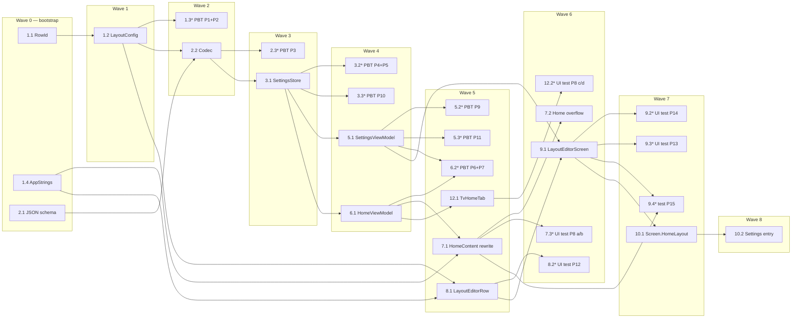

# Implementation Plan: Home Layout Customization

## Overview

Implement user-customizable Home Screen row order and visibility for the Anisurge KMP Compose Multiplatform app. Build the data model and JSON codec first, persist through `SettingsStore` with healing/version semantics, then wire the flow into `SettingsViewModel` and `HomeViewModel`. Once the state pipeline is live, rewrite `HomeContent` to render layout-driven, build the `LayoutEditorScreen`, wire navigation and discoverability entries, and finally consume the same flow in the TV variant. Property-based tests for all 15 design properties run alongside the implementation tasks they cover.

Convert the feature design into a series of prompts for a code-generation LLM that will implement each step with incremental progress. Make sure that each prompt builds on the previous prompts, and ends with wiring things together. There should be no hanging or orphaned code that isn't integrated into a previous step. Focus ONLY on tasks that involve writing, modifying, or testing code.

## Tasks

- [x] 1. Set up data models and localization strings
  - [x] 1.1 Create `RowId` enum
    - Add `composeApp/src/commonMain/kotlin/to/kuudere/anisuge/data/models/RowId.kt`
    - Define enum entries `CONTINUE_WATCHING`, `LATEST_EPISODES`, `NEW_ON_APP`, `UPCOMING` with `storageId` strings matching the four canonical literals
    - Add `fromStorageId(id: String): RowId?` (case-sensitive) and `TV_SUPPORTED: Set<RowId>` companion members
    - Annotate with `@Serializable` for kotlinx.serialization compatibility
    - _Requirements: 1.1, 1.3, 9.1_

  - [x] 1.2 Create `LayoutConfig`, `LayoutRow`, and operations
    - Add `composeApp/src/commonMain/kotlin/to/kuudere/anisuge/data/models/LayoutConfig.kt`
    - Define `data class LayoutRow(id: RowId, visible: Boolean)` and `data class LayoutConfig(rows: List<LayoutRow>)`
    - Add `companion object` with `SCHEMA_VERSION = 1` and `DEFAULT` (all four rows, visible, in canonical order)
    - Implement `sanitize()` (drop unknown ids implicit, dedupe by first occurrence), `mergeWithDefaults()` (append missing rows in DEFAULT order with `visible = true`), `moveUp(id)`, `moveDown(id)`, `reorder(fromIndex, toIndex)`, `setVisible(id, visible)`
    - _Requirements: 1.3, 1.4, 1.5, 2.2, 4.8, 6.6_

  - [ ]* 1.3 Write property tests for `LayoutConfig` pure operations
    - **Property 1: Sanitization correctness** — `LayoutConfigSanitizeTest.kt`
      - **Validates: Requirements 1.3, 1.5**
    - **Property 2: `mergeWithDefaults` completeness** — `LayoutConfigMergeTest.kt`
      - **Validates: Requirements 1.4, 2.2, 4.8, 6.6**
    - Use `Arb.layoutRow()` and `Arb.layoutConfig()` generators from kotest-property; run each `checkAll(iterations = 100)`
    - Tag each test in a doc comment: `// Feature: home-layout-customization, Property N: ...`
    - _Requirements: 1.3, 1.4, 1.5, 2.2, 4.8, 6.6_

  - [x] 1.4 Add localized strings for row titles and editor copy
    - Edit `composeApp/src/commonMain/kotlin/to/kuudere/anisuge/i18n/AppStrings.kt`
    - Add entries for the four row titles (`continueWatching`, `latestEpisodes`, `newOnApp`, `upcoming`) keyed for use in `HomeContent` headers and `LayoutEditorScreen`
    - Add entries for editor copy: screen title, "Reset to defaults", confirm dialog text, "Visible"/"Hidden" indicator, "Move up"/"Move down" content descriptions, save-failure banner text, "Retry", empty-layout placeholder text and "Open Layout Editor" button
    - Provide English strings; mirror existing `AppStrings` per-locale convention with `RowId.storageId` literal as the documented fallback for missing locales
    - _Requirements: 4.6, 7.1, 10.6, 12.4_

- [x] 2. Implement JSON schema and codec
  - [x] 2.1 Create `LayoutConfigJson` and `LayoutRowJson` schema types
    - Add `composeApp/src/commonMain/kotlin/to/kuudere/anisuge/data/models/LayoutConfigJson.kt`
    - Define `@Serializable data class LayoutConfigJson(version: Int, rows: List<LayoutRowJson>)` and `@Serializable data class LayoutRowJson(id: String, visible: Boolean)`
    - _Requirements: 11.1, 11.2_

  - [x] 2.2 Create `LayoutConfigCodec` with `DecodeResult`
    - Add `composeApp/src/commonMain/kotlin/to/kuudere/anisuge/data/services/LayoutConfigCodec.kt`
    - Define `sealed interface DecodeResult` with variants `Success(config: LayoutConfig)`, `VersionTooNew(version: Int)`, `Invalid(reason: String)`
    - Implement `encode(config: LayoutConfig): String` that always emits `version = SCHEMA_VERSION`
    - Implement `decode(jsonString: String): DecodeResult` using `Json { ignoreUnknownKeys = true }` per workspace convention; return `VersionTooNew` when `version > SCHEMA_VERSION`, `Invalid` for malformed JSON / wrong types / missing fields, otherwise `Success` after mapping `LayoutRowJson.id` via `RowId.fromStorageId`
    - _Requirements: 6.4, 6.5, 11.3, 11.5, 11.6_

  - [ ]* 2.3 Write property test for codec round-trip
    - **Property 3: JSON encode/decode round-trip** — `LayoutConfigCodecTest.kt`
    - **Validates: Requirements 6.5, 11.1, 11.2**
    - Generate sanitized + merged `LayoutConfig` via `Arb.layoutConfig()`; assert `decode(encode(c))` equals `Success(c)` and that the encoded JSON has integer `version == SCHEMA_VERSION` and a well-formed `rows` array
    - _Requirements: 6.5, 11.1, 11.2_

- [x] 3. Extend `SettingsStore` for layout persistence
  - [x] 3.1 Add `HOME_LAYOUT_KEY`, `homeLayoutFlow`, `setHomeLayout`, `healHomeLayoutIfNeeded`
    - Edit `composeApp/src/commonMain/kotlin/to/kuudere/anisuge/data/services/SettingsStore.kt`
    - Define `HOME_LAYOUT_KEY = stringPreferencesKey("home_layout_v1")`
    - Build `homeLayoutFlow: Flow<LayoutConfig>` from `dataStore.data` with `.catch { Logger.w("SettingsStore", ...); emit(emptyPreferences()) }`, then `.map` raw value through `LayoutConfigCodec.decode` returning `DEFAULT` for `null`/blank/`VersionTooNew`/`Invalid` and `config.sanitize().mergeWithDefaults()` for `Success`; finish with `.distinctUntilChanged()`
    - Implement `suspend fun setHomeLayout(config: LayoutConfig)` writing exactly one DataStore key with `LayoutConfigCodec.encode(config)`
    - Implement `suspend fun healHomeLayoutIfNeeded(seen: LayoutConfig)`: read raw bytes once, on `Invalid` overwrite with `encode(DEFAULT)`, on `Success` overwrite only if sanitized result differs from raw, on `VersionTooNew` leave bytes untouched
    - _Requirements: 6.1, 6.3, 6.4, 11.3, 11.4, 11.5, 12.1, 12.2_

  - [ ]* 3.2 Write property tests for store decode behavior
    - **Property 4: Invalid input falls back to `Default_Layout` and overwrites** — `SettingsStoreLayoutInvalidTest.kt`
      - **Validates: Requirements 2.3, 2.4, 6.4, 11.5**
    - **Property 5: Version-too-new preserves stored bytes** — `SettingsStoreLayoutVersionTest.kt`
      - **Validates: Requirements 11.3, 11.4**
    - Use `PreferenceDataStoreFactory.create(produceFile = { tempFile })` against a JVM temp file; generate inputs via `Arb.versionedLayoutJson(...)`; assert flow emits `DEFAULT` and `HOME_LAYOUT_KEY` storage matches the variant's contract after `healHomeLayoutIfNeeded`
    - _Requirements: 2.3, 2.4, 6.4, 11.3, 11.4, 11.5_

  - [ ]* 3.3 Write property test for store read-failure resilience
    - **Property 10: Read failure produces `Default_Layout` without a blocking dialog** — `SettingsStoreReadFailureTest.kt`
    - **Validates: Requirements 12.1, 12.2**
    - Inject a faulty `DataStore` whose `data` flow throws; assert `homeLayoutFlow` emits `LayoutConfig.DEFAULT` within a `TestDispatcher`-advanced 2 s budget and an entry is recorded via the application logger
    - _Requirements: 12.1, 12.2_

- [x] 4. Checkpoint - Ensure data and persistence tests pass
  - Ensure all tests pass, ask the user if questions arise.

- [x] 5. Wire `SettingsViewModel` for layout editing
  - [x] 5.1 Extend `SettingsViewModel` state and actions
    - Edit `SettingsViewModel.kt` (under `screens/settings/`)
    - Add `homeLayout: LayoutConfig = LayoutConfig.DEFAULT` and `layoutSaveError: String? = null` to `SettingsUiState`
    - Collect `settingsStore.homeLayoutFlow` in `init` and update `_uiState` via `StateFlow.update { ... }`
    - Implement `setHomeLayout(next: LayoutConfig)`: sanitize+merge, call `settingsStore.setHomeLayout` inside try/catch, clear error on success, set `layoutSaveError` on failure (do not roll back)
    - Implement `resetHomeLayout()` (delegate to `setHomeLayout(LayoutConfig.DEFAULT)`), `retrySaveHomeLayout()` (re-submit current `homeLayout`), `dismissLayoutSaveError()` (clear error)
    - _Requirements: 5.4, 7.3, 7.6, 12.3, 12.4, 12.5, 12.6_

  - [ ]* 5.2 Write property test for persist-failure semantics
    - **Property 9: Persist failure preserves user intent and surfaces a non-blocking error** — `LayoutPersistFailureTest.kt`
    - **Validates: Requirements 3.6, 4.7, 5.4, 7.6, 12.3, 12.4, 12.5, 12.6**
    - Use a mock `SettingsStore` whose `setHomeLayout` throws; assert flow remains last-good, `pendingLayout` (intended) is preserved, `layoutSaveError` is non-null, retry re-invokes the store, success clears error within 1 s `TestDispatcher` budget
    - _Requirements: 3.6, 4.7, 5.4, 7.6, 12.3, 12.4, 12.5, 12.6_

  - [ ]* 5.3 Write property test for reset behavior
    - **Property 11: Reset replaces stored layout with `Default_Layout`** — `LayoutResetTest.kt`
    - **Validates: Requirements 7.3, 7.4**
    - Generate arbitrary starting `LayoutConfig`; call `resetHomeLayout()`; assert `homeLayoutFlow` emits `DEFAULT` within 1 s `TestDispatcher` budget and stored bytes equal `LayoutConfigCodec.encode(DEFAULT)`
    - _Requirements: 7.3, 7.4_

- [x] 6. Wire `HomeViewModel` for layout consumption
  - [x] 6.1 Add `layout` to `HomeUiState` and project visible rows
    - Edit `HomeViewModel.kt` (under `screens/home/`)
    - Add `layout: LayoutConfig = LayoutConfig.DEFAULT` to `HomeUiState`
    - In `init`, launch a coroutine collecting `settingsStore.homeLayoutFlow` and updating `_uiState`; launch a second coroutine that awaits the first emission then calls `settingsStore.healHomeLayoutIfNeeded(layout)`
    - Add `fun visibleRowsForMobile(state): List<RowId>` and `fun visibleRowsForTv(state): List<RowId>` (filter by `visible` and, for TV, `RowId.TV_SUPPORTED`)
    - _Requirements: 5.1, 5.2, 5.3, 6.2, 9.1, 9.4_

  - [ ]* 6.2 Write property tests for reorder and toggle propagation
    - **Property 6: Reorder correctness, propagation, and persistence** — `LayoutReorderPropagationTest.kt`
      - **Validates: Requirements 3.2, 3.3, 3.4, 5.1, 5.2, 5.3, 6.1**
    - **Property 7: Visibility toggle correctness, propagation, and persistence** — `LayoutToggleTest.kt`
      - **Validates: Requirements 4.1, 4.2, 4.4**
    - Run on `StandardTestDispatcher` with `advanceTimeBy`/`advanceUntilIdle`; generate inputs via `Arb.layoutConfig()`; assert flow emits within 500 ms, `HomeViewModel.uiState.layout` updates within 1 s, exactly one DataStore key is modified
    - _Requirements: 3.2, 3.3, 3.4, 4.1, 4.2, 4.4, 5.1, 5.2, 5.3, 6.1_

- [x] 7. Rewrite `HomeContent` to be layout-driven
  - [x] 7.1 Replace hardcoded sections with layout iteration plus empty placeholder
    - Edit `composeApp/src/commonMain/kotlin/to/kuudere/anisuge/screens/home/HomeScreen.kt`
    - Compute `orderedRowIds = state.layout.rows.filter { it.visible }.map { it.id }` and `nonEmptyRowIds = orderedRowIds.filter { state.hasDataForRow(it) }`; add private `fun HomeUiState.hasDataForRow(id: RowId): Boolean` mapping each `RowId` to its underlying list (`continueWatching`, `latestAired`, `newOnSite`, `upcoming`)
    - Replace the four hardcoded `if` blocks below the hero with a single `forEach` over `nonEmptyRowIds` with a `when` branch per `RowId`; preserve existing section composables (header, horizontal list, spacing) inside each branch so the row, its header, and its spacing are skipped together
    - When `orderedRowIds.isEmpty()` render `EmptyLayoutPlaceholder(onOpenEditor)` (a new composable in the same file) consisting of localized text plus a button that invokes the editor entry callback
    - Plumb `onOpenLayoutEditor: () -> Unit` through `HomeScreen` / `HomeContent` parameters from the navigation host
    - _Requirements: 4.3, 4.5, 4.6, 5.1, 5.2_

  - [x] 7.2 Add Home top-bar overflow entry for the editor
    - Edit `HomeScreen.kt` to add a "Home Layout" item to the existing top-bar overflow `DropdownMenu`
    - Wire the menu item to invoke `onOpenLayoutEditor`; surface navigation failures via the existing snackbar host
    - _Requirements: 8.3, 8.4, 8.5_

  - [ ]* 7.3 Compose UI test for `HomeContent` render projection
    - **Property 8 (a, b): Mobile render projection and empty-layout placeholder** — `HomeContentProjectionTest.kt`
    - **Validates: Requirements 4.3, 4.5, 4.6**
    - Use `runComposeUiTest`; generate `LayoutConfig` and data-population subsets via `Arb`; assert rendered row tags equal `layout.rows.filter { it.visible && hasDataForRow(it.id) }` in order, and that the empty-layout placeholder with the editor button renders when no rows are visible
    - _Requirements: 4.3, 4.5, 4.6_

- [x] 8. Build the layout editor row component
  - [x] 8.1 Create `LayoutEditorRow` composable
    - Add `composeApp/src/commonMain/kotlin/to/kuudere/anisuge/screens/settings/layout/LayoutEditorRow.kt`
    - Render leading drag handle that accepts `pointerInput { detectDragGestures }` and reports drag-end with accumulated translation
    - Render localized title text (with `RowId.storageId` fallback per `AppStrings` lookup), a "Visible"/"Hidden" textual indicator, a Material `Switch` bound to `row.visible`
    - Render `IconButton(Move up)` with `enabled = !isFirst` and `IconButton(Move down)` with `enabled = !isLast`; both controls reuse the existing `tvFocusableClick` modifier from `to.kuudere.anisuge.ui.TvFocus`
    - Apply `Modifier.semantics { stateDescription = ... }` reflecting localized title, 1-based index of total, and "Shown"/"Hidden"; mark Move up/Move down disabled state via `disabled` semantics property
    - _Requirements: 3.1, 3.2, 3.4, 3.5, 4.1, 10.1, 10.2, 10.3, 10.4, 10.5, 10.6_

  - [ ]* 8.2 Compose UI test for boundary Move controls
    - **Property 12: Boundary Move controls are disabled** — `LayoutEditorBoundaryControlsTest.kt`
    - **Validates: Requirements 10.2, 10.3**
    - Generate `LayoutConfig` of size `>= 1`; assert that `Move up` on index 0 and `Move down` on index `n-1` reject `performClick`, `performKeyInput { Enter / Space }`, and `performKeyInput { DPadCenter }`, and that the disabled state is exposed through semantics
    - _Requirements: 10.2, 10.3_

- [x] 9. Build `LayoutEditorScreen`
  - [x] 9.1 Create `LayoutEditorScreen`
    - Add `composeApp/src/commonMain/kotlin/to/kuudere/anisuge/screens/settings/layout/LayoutEditorScreen.kt`
    - Collect `settingsViewModel.uiState` and bind `pendingLayout` to the latest persisted `homeLayout` via `LaunchedEffect(homeLayout) { pendingLayout = homeLayout }`
    - Render top app bar with back arrow and a "Reset to defaults" action; render a vertical `Column` of `LayoutEditorRow` items (max four rows so non-lazy is safe per design)
    - On drag-release, swap rows in `pendingLayout` and call `settingsViewModel.setHomeLayout(pendingLayout)`; toggle, Move up, Move down call the same action with the appropriate `LayoutConfig` operation
    - Implement reset flow with the existing `to.kuudere.anisuge.ui.ConfirmDialog`; on confirm call `settingsViewModel.resetHomeLayout()`; on cancel dismiss
    - Render the non-blocking save-error banner above the list when `layoutSaveError != null`, with a "Retry" button calling `retrySaveHomeLayout()` and a dismiss action calling `dismissLayoutSaveError()`
    - _Requirements: 3.1, 3.6, 4.1, 4.7, 7.1, 7.2, 7.5, 7.6, 12.3, 12.4, 12.5, 12.6_

  - [ ]* 9.2 Compose UI test for editor row presence and indicators
    - **Property 14: Editor row presence and indicators** — `LayoutEditorRowsTest.kt`
    - **Validates: Requirements 3.1, 4.1**
    - Generate `LayoutConfig`; assert exactly `layout.rows.size` `LayoutEditorRow` instances rendered, each with localized title, "Visible"/"Hidden" indicator matching `visible`, and a `Switch` whose state matches `visible`
    - _Requirements: 3.1, 4.1_

  - [ ]* 9.3 Compose UI test for accessibility announcements
    - **Property 13: Accessibility announcements after order or visibility change** — `LayoutEditorA11yTest.kt`
    - **Validates: Requirements 10.4, 10.5**
    - Drive the editor with `performKeyInput` Enter/Space and D-pad center on Move up/Move down/Switch; advance `TestDispatcher` by 500 ms; assert `SemanticsNode.stateDescription` updates with localized title + new 1-based index + total or "Shown"/"Hidden"
    - _Requirements: 10.4, 10.5_

  - [ ]* 9.4 Test for localized title fallback
    - **Property 15: Localized title fallback** — `LayoutEditorLocalizationTest.kt`
    - **Validates: Requirements 10.6**
    - Provide `LocalAppStrings` with each row title null in turn; assert both `LayoutEditorScreen` and `HomeContent` headers render the `RowId.storageId` literal as fallback for the missing locale entries
    - _Requirements: 10.6_

- [x] 10. Wire navigation and discoverability entries
  - [x] 10.1 Add `Screen.HomeLayout` route and register the destination
    - Edit `composeApp/src/commonMain/kotlin/to/kuudere/anisuge/navigation/Screen.kt` to add `data object HomeLayout : Screen("settings/home-layout")`
    - Register the route in the application `NavHost` (in `App.kt` or wherever routes are wired) to render `LayoutEditorScreen`; wrap `navController.navigate(Screen.HomeLayout.route)` call sites in try/catch and emit a localized snackbar message on failure
    - Provide the `onOpenLayoutEditor` callback to `HomeScreen` so the overflow item from task 7.2 navigates here
    - _Requirements: 8.2, 8.4, 8.5_

  - [x] 10.2 Add Settings → Appearance entry for "Home Layout"
    - Edit `composeApp/src/commonMain/kotlin/to/kuudere/anisuge/screens/settings/SettingsScreen.kt`
    - Add a navigable list item under the Appearance tab with a localized "Home Layout" label that invokes `navController.navigate(Screen.HomeLayout.route)` (try/catch wrapped per 10.1)
    - Place near other Appearance entries; do not alter existing entries
    - _Requirements: 8.1, 8.2, 8.5_

- [x] 11. Checkpoint - Ensure editor and integration tests pass
  - Ensure all tests pass, ask the user if questions arise.

- [x] 12. Wire TV variant consumption
  - [x] 12.1 Update `TvHomeTab` to iterate the layout filtered by `TV_SUPPORTED`
    - Edit `composeApp/src/commonMain/kotlin/to/kuudere/anisuge/screens/tv/TvAppShell.kt`
    - Replace hardcoded `continueWatching` / `latestAired` blocks below the hero with `state.layout.rows.filter { it.visible && it.id in RowId.TV_SUPPORTED }.forEach { ... }` and a `when` branch per supported `RowId` (silently skip unsupported ids)
    - Confirm no UI affordance opens or invokes `LayoutEditorScreen` from `TvHomeTab`
    - When the filtered subset is empty, render no error UI; the TV shell continues to be navigable
    - _Requirements: 9.1, 9.2, 9.3, 9.4, 9.5_

  - [ ]* 12.2 Compose UI test for TV render projection
    - **Property 8 (c, d): TV render projection and empty rows-area behavior** — `TvHomeTabProjectionTest.kt`
    - **Validates: Requirements 9.1, 9.2, 9.4, 9.5**
    - Generate `LayoutConfig` and TV-side data populations; assert rendered row set equals `layout.rows.filter { it.visible && it.id in TV_SUPPORTED && hasDataForRow(it.id) }`, no error UI is present when filtered set is empty, and unsupported ids are silently skipped
    - _Requirements: 9.1, 9.2, 9.4, 9.5_

- [x] 13. Final checkpoint - Ensure all tests pass
  - Ensure all tests pass, ask the user if questions arise.

## Notes

- Tasks marked with `*` are optional and can be skipped for faster MVP; they correspond to the property and UI tests defined in the design's Testing Strategy and the 15 Correctness Properties.
- Each leaf task references its requirements clauses; test sub-tasks additionally annotate the property number (P1–P15) they exercise so traceability flows: requirement → property → test.
- Settings apply immediately via `SettingsStore` Flows per AGENTS.md (no Save button); kotlinx.serialization uses `ignoreUnknownKeys = true` per workspace convention.
- The four-row maximum keeps `LayoutEditorScreen` non-lazy and dependency-free (no third-party drag-reorder library).
- TV variant consumes the same `homeLayoutFlow` indirectly via `HomeViewModel`; cross-device propagation occurs on the TV's next composition.
- Property tests use `kotest-property` with `iterations = 100` minimum; coroutine timing budgets are validated under `StandardTestDispatcher`, not wall-clock.
- Compose UI tests use `runComposeUiTest` with `performKeyInput` for keyboard/D-pad and `performTouchInput` for drag handles.
- The asymmetric decode behavior (`Invalid` overwrites with `DEFAULT`, `VersionTooNew` preserves bytes) is implemented in `SettingsStore.healHomeLayoutIfNeeded`; both sides are property-tested in tasks 3.2 and 3.3.

## Task Dependency Graph

```json
{
  "waves": [
    { "id": 0, "tasks": ["1.1", "1.4", "2.1"] },
    { "id": 1, "tasks": ["1.2"] },
    { "id": 2, "tasks": ["1.3", "2.2"] },
    { "id": 3, "tasks": ["2.3", "3.1"] },
    { "id": 4, "tasks": ["3.2", "3.3", "5.1", "6.1"] },
    { "id": 5, "tasks": ["5.2", "5.3", "6.2", "7.1", "8.1", "12.1"] },
    { "id": 6, "tasks": ["7.2", "7.3", "8.2", "9.1", "12.2"] },
    { "id": 7, "tasks": ["9.2", "9.3", "9.4", "10.1"] },
    { "id": 8, "tasks": ["10.2"] }
  ]
}
```



## Workflow Completion

This workflow is complete. The requirements, design, and tasks artifacts are all in place at `.kiro/specs/home-layout-customization/`.

To begin executing tasks, open `.kiro/specs/home-layout-customization/tasks.md` and click "Start task" next to a task item.
