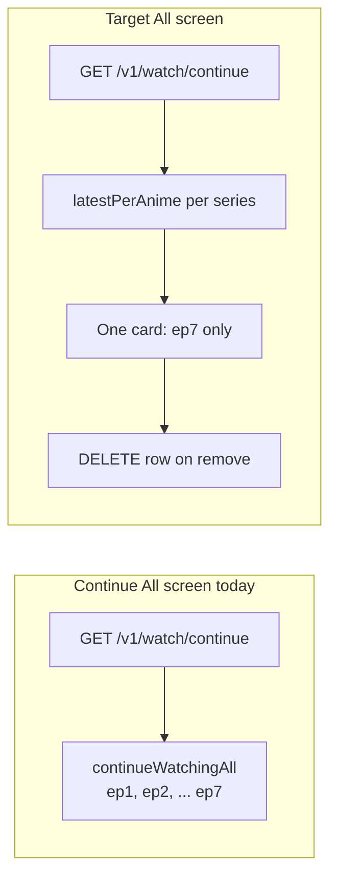

# Community features implementation plan

## Current state (what you already have)

| Feature | Status |
|---------|--------|
| Screen fit / fill | **Backend only** — mpv maps `Fit` / `Zoom` in [`VideoPlayer.kt`](composeApp/src/commonMain/kotlin/to/kuudere/anisuge/player/VideoPlayer.kt) + [`VideoPlayerSurface.kt` (Android)](composeApp/src/androidMain/kotlin/to/kuudere/anisuge/player/VideoPlayerSurface.kt) / [`MpvPlayer.kt`](composeApp/src/desktopMain/kotlin/to/kuudere/anisuge/player/MpvPlayer.kt); **no UI** |
| Playback speed | **Done** — Settings overlay presets in [`SettingsOverlay.kt`](composeApp/src/commonMain/kotlin/to/kuudere/anisuge/screens/watch/SettingsOverlay.kt) |
| Custom themes | **Dark-only** hardcoded in [`Theme.kt`](composeApp/src/commonMain/kotlin/to/kuudere/anisuge/theme/Theme.kt); no `SettingsStore` theme key |
| Android PiP | **Not present** (you’re re-adding — coordinate so we don’t conflict) |
| Hold speed-up | **Not present** |
| Chromecast | **Not present** |
| Continue “All” list | Shows **every** BFF row via `continueWatchingAll` in [`ContinueWatchingScreen.kt`](composeApp/src/commonMain/kotlin/to/kuudere/anisuge/screens/home/ContinueWatchingScreen.kt); home row already dedupes with [`latestPerAnime()`](composeApp/src/commonMain/kotlin/to/kuudere/anisuge/utils/ContinueWatchingUtils.kt) |
| Continue delete | Home X is a **stub** (`/* Handle delete later */` in [`HomeScreen.kt`](composeApp/src/commonMain/kotlin/to/kuudere/anisuge/screens/home/HomeScreen.kt) ~1476); **no** `DELETE` client call in [`HomeService.kt`](composeApp/src/commonMain/kotlin/to/kuudere/anisuge/data/services/HomeService.kt) |

---

## Phase 1 — Quick wins (1–2 days)

### 1) Screen fit & screen fill (highest votes, lowest effort)

**Mapping (do not use `Stretch` for “fill” — it forces 16:9 and distorts):**

| UI label | `playerState.aspectRatio` | mpv behavior |
|----------|---------------------------|--------------|
| Screen fit | `Fit` | Letterbox, full frame visible |
| Screen fill | `Zoom` | `panscan=1.0`, crop to fill window |

**Changes:**
- Add `videoScaleMode` to `WatchUiState` + `WatchViewModel.setVideoScaleMode()` ([`WatchViewModel.kt`](composeApp/src/commonMain/kotlin/to/kuudere/anisuge/screens/watch/WatchViewModel.kt)).
- Sync like speed: `LaunchedEffect` in [`WatchScreen.kt`](composeApp/src/commonMain/kotlin/to/kuudere/anisuge/screens/watch/WatchScreen.kt) → `playerState.aspectRatio`.
- UI: new page under player settings overlay ([`SettingsOverlay.kt`](composeApp/src/commonMain/kotlin/to/kuudere/anisuge/screens/watch/SettingsOverlay.kt)) — “Screen fit” / “Screen fill”; optional icon on [`PlayerControls.kt`](composeApp/src/commonMain/kotlin/to/kuudere/anisuge/player/PlayerControls.kt).
- Persist in [`SettingsStore.kt`](composeApp/src/commonMain/kotlin/to/kuudere/anisuge/data/services/SettingsStore.kt) (speed is session-only today; fit/fill should survive restarts).

### 4) Hold Shift (desktop) / long-press (mobile) to speed up

**Behavior:** While held → temporary speed (e.g. `2.0x`); on release → restore previous speed (from `WatchUiState.playbackSpeed`).

**Changes:**
- [`PlayerControls.kt`](composeApp/src/commonMain/kotlin/to/kuudere/anisuge/player/PlayerControls.kt) or watch root: `pointerInput` + `detectTapGestures(onPress = { … })` for long-press; desktop `Modifier.onKeyEvent` when Shift held (only when player focused / not in text field).
- Track `boostSpeedActive` in `WatchViewModel`; apply via existing `setSpeed` / `playerState.playbackSpeed` without overwriting saved preset when releasing.
- Settings: optional boost multiplier (default `2.0`) in player settings or `SettingsStore`.

### 6) Continue watching — “All” shows current episode only + delete

**App (main fix):**
- [`ContinueWatchingScreen.kt`](composeApp/src/commonMain/kotlin/to/kuudere/anisuge/screens/home/ContinueWatchingScreen.kt): list `continueWatchingAll.latestPerAnime()` (same rule as home carousel), not raw `continueWatchingAll`.
- Optional subtitle: “Showing latest episode per series”.
- Wire delete on full list + home row stub:
  - Add `HomeService.deleteContinueWatching(animeId, episodeId)` → `DELETE /v1/watch/continue/{animeId}/{episodeId}` (confirm path against live BFF / `api.md` when implementing).
  - `HomeViewModel.removeContinueItem(...)` → optimistic UI remove + refresh.
  - Swipe-to-delete or long-press menu on [`ContinueWatchingScreen`](composeApp/src/commonMain/kotlin/to/kuudere/anisuge/screens/home/ContinueWatchingScreen.kt); connect home hover X in [`HomeScreen.kt`](composeApp/src/commonMain/kotlin/to/kuudere/anisuge/screens/home/HomeScreen.kt).

**BFF (verify, small if missing):**
- Confirm `DELETE /v1/watch/continue/:animeId/:episodeId` exists on deployed `https://db.anisurge.qzz.io` and invalidates Redis cache for `GET /v1/watch/continue` (per AGENTS.md cache keys).
- If delete only removes one row: deleting ep7 leaves ep1–6 in DB but hidden from UI — acceptable for v1; optional later `DELETE` all rows for `animeId` if product wants “remove series from continue”.

**No BFF change required** for “show only current episode” — that’s purely client dedupe via existing [`latestPerAnime()`](composeApp/src/commonMain/kotlin/to/kuudere/anisuge/utils/ContinueWatchingUtils.kt).

---

## Phase 2 — Medium (3–5 days)

### 2) Custom themes — preset packs (your choice: presets only)

**Approach:** Define 4–6 named schemes (e.g. `Default`, `AMOLED`, `Purple`, `Netflix red`, `High contrast`) as data classes mapping to `ColorScheme` + shared semantic tokens.

**Changes:**
- Extend [`Theme.kt`](composeApp/src/commonMain/kotlin/to/kuudere/anisuge/theme/Theme.kt): `AnisugTheme(themeId: AppThemeId)` selects scheme.
- `SettingsStore`: `themeId` string + `Flow`; load in [`App.kt`](composeApp/src/commonMain/kotlin/to/kuudere/anisuge/App.kt) root.
- [`AppearanceTab`](composeApp/src/commonMain/kotlin/to/kuudere/anisuge/screens/settings/SettingsScreen.kt): horizontal chips or list with live preview swatch.
- **Incremental migration:** replace top-level hardcoded `Color(0xFF…)` on hot paths (home, watch, settings) with `MaterialTheme.colorScheme.*` over time; v1 can ship presets even if some screens keep legacy colors.

**Out of scope for v1:** full color picker, per-channel custom hex, light mode (unless one preset is explicitly “light”).

### 3) Android Picture-in-Picture (you’re owning this)

**Gap today:** no `supportsPictureInPicture` in manifest, no `enterPictureInPictureMode` in [`MainActivity.kt`](composeApp/src/androidMain/kotlin/to/kuudere/anisuge/MainActivity.kt).

**Recommended integration (avoid merge conflicts with your branch):**
- PiP only from [`WatchScreen`](composeApp/src/commonMain/kotlin/to/kuudere/anisuge/screens/watch/WatchScreen.kt) while `VideoPlayerSurface` is active.
- `MainActivity`: PiP params (16:9 aspect), `onPictureInPictureModeChanged`, keep mpv `SurfaceView` alive.
- User action: PiP button in player controls + auto-enter on home if OS allows (optional).
- **Coordinate:** don’t duplicate player lifecycle work in Phase 1 fit/fill PRs — touch different files where possible.

---

## Phase 3 — Large (1–2+ weeks)

### 5) Chromecast (Google Cast) — Android first

**Scope (per your answer):** Cast SDK on **Android** only for v1; desktop cast later if needed.

**High-level work:**
- Add Cast dependencies + `CastOptionsProvider` in Android manifest.
- `CastManager` (androidMain): session, `RemoteMediaClient`, load HLS URL with same headers as playback ([`StreamProxy`](composeApp) / referer from `StreamingData`).
- Player UI: Cast button when device available; pause local mpv when casting.
- **Hard parts:** DRM/encrypted HLS may not cast; header-only streams (Suzu/Anitaku) need `CustomData` / `HlsSegmentFormat` testing; fallback message when cast unsupported.

**Out of v1:** DLNA, AirPlay, desktop Cast.

### 4) Hold-to-speed-up on TV

Defer or use D-pad long-press on [`TvAppShell`](composeApp/src/commonMain/kotlin/to/kuudere/anisuge/screens/tv/TvAppShell.kt) if TV watch exists — not in Phase 1 unless trivial.

---

## Suggested delivery order

1. **Continue watching All + delete** — addresses confusion + highly specific feedback  
2. **Screen fit / fill** — wired UI, tiny diff  
3. **Hold to speed up** — popular, isolated gesture code  
4. **Preset themes** — visible settings win  
5. **PiP** — parallel with you  
6. **Chromecast** — separate branch/release  

---

## Testing checklist

| Feature | Verify |
|---------|--------|
| Fit / fill | Letterbox vs crop on 16:9 and 4:3 video; Android + Windows desktop |
| Hold speed | Shift+hold desktop; long-press phone; release restores prior speed |
| Continue All | Series at ep7 shows **one** card (ep7); not ep1–7 |
| Delete | Removed item stays gone after refresh; home X works |
| Themes | Switch preset → settings + home reflect new accent/background |
| PiP | Play → PiP → resume full screen; audio continues |
| Cast | Discover Chromecast, play episode, seek; Anitaku/Suzu referer streams |

---

## Risks / notes

- **BFF repo** (`services/anisurge-api/`) is not in this workspace — delete endpoint must be verified on deploy before wiring UI.
- **Continue list limit:** client uses `limit=100`; align with BFF max if 50 to avoid partial pages.
- **Screencast + offline:** cast likely online-only; disable or hide when `offlinePath != null`.
